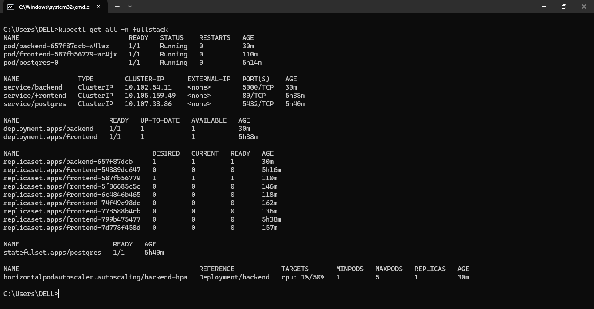
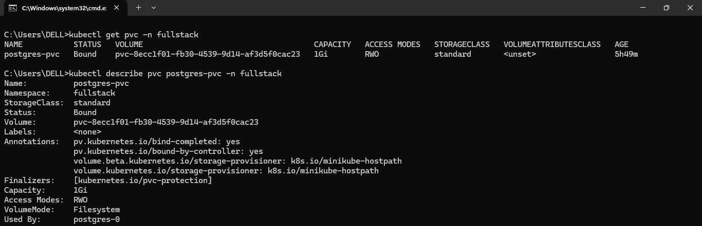
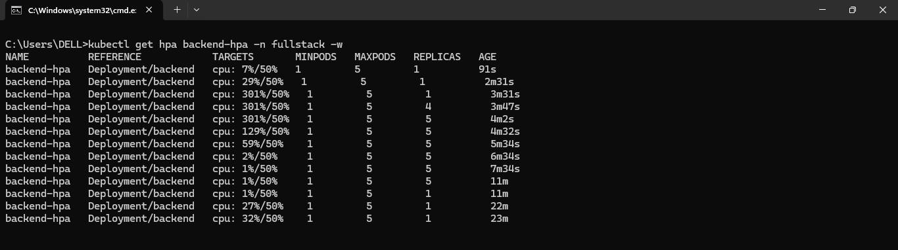
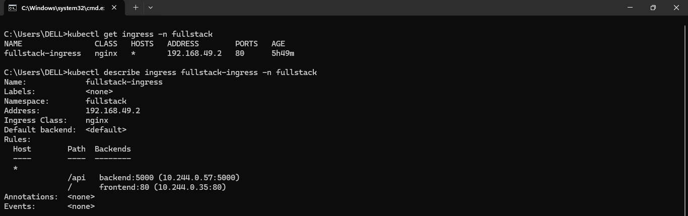
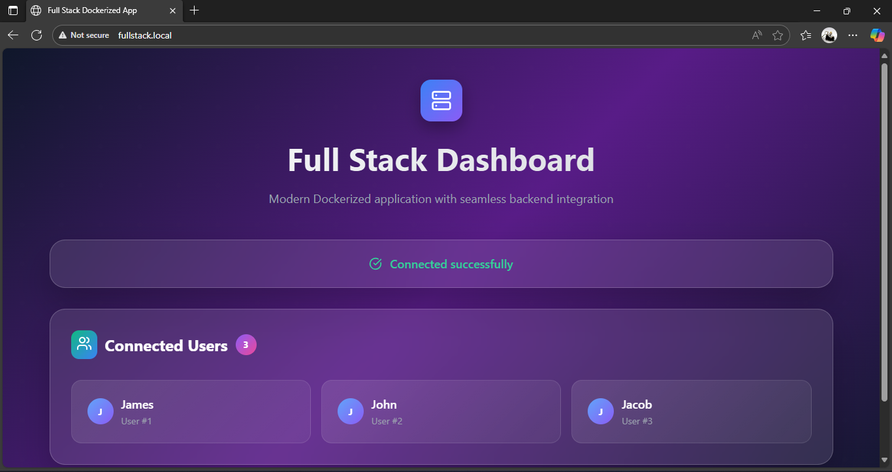

# Fullstack App Deploment on Kubernetes 

[](https://kubernetes.io/)
[](https://www.docker.com/)
[](https://reactjs.org/)
[](https://nodejs.org/)

---

## Project Overview

This project demonstrates a **fullstack application deployed on Kubernetes** using **Minikube** for local development and testing. It includes:

* **Frontend:** React app served on NGINX
* **Backend:** Node.js/Express API server
* **Database:** PostgreSQL with persistent storage

**Kubernetes features demonstrated:**

* Deployments & StatefulSet
* Services & ClusterIP
* Secrets & ConfigMaps
* NGINX Ingress for routing
* Horizontal Pod Autoscaler (HPA)

This setup simulates a **production-grade Kubernetes deployment**, demonstrating best practices and industry standards.

## Features

* Full **frontend + backend + database** deployment on Kubernetes
* **Secrets** for sensitive DB credentials
* **ConfigMaps** for environment variables
* **StatefulSet** for Postgres with **persistent storage**
* **NGINX Ingress** for routing frontend and backend
* **Horizontal Pod Autoscaler (HPA)** for autoscaling
* Fully **Dockerized** and pushed to Docker Hub

---

## Prerequisites

* [Minikube (for local use)](https://minikube.sigs.k8s.io/docs/start/)
* [kubectl (K8s CLI)](https://kubernetes.io/docs/tasks/tools/)
* Docker (for local builds)

> Add a hosts file entry to access the app via domain:

```text
<MINIKUBE_IP> fullstack.local
```

Check minikube IP:

```bash
minikube ip
```

---

## Deployment Steps

### Step 1: Start Minikube & enable required addons

```bash
minikube start
minikube addons enable ingress
minikube addons enable metrics-server
```

### Step 2: Apply Kubernetes resources

All YAMLs are in the `k8s/` folder:

```bash
kubectl apply -f k8s/
```

This deploys:

* Namespace, Secrets, ConfigMaps
* Postgres StatefulSet + PVC
* Backend & Frontend Deployments & Services
* Ingress
* HPA for Autoscaling

### Step 3: Verify deployment

```bash
kubectl get all -n fullstack
kubectl get pvc -n fullstack
kubectl describe ingress fullstack-ingress -n fullstack
kubectl get hpa -n fullstack
```

### Step 4: Access the application

Open browser:

```
http://fullstack.local
```

API calls are routed to `/api` automatically via Ingress.

---

## Visuals 📸
* **Pods & Services**
  

* **Persistent Volumes**
  

* **HPA Status**
  
  Backend autoscaling in action. The Horizontal Pod Autoscaler will **scale up quickly under load** but will **wait for the stabilization period (default 5 minutes) before scaling down**.

* **Ingress Routing**
  

* **Frontend in Browser**
  
   User interface loaded successfully, confirming the backend and database are operational.

---
## Tech Stack

* **Frontend:** React, NGINX
* **Backend:** Node.js, Express
* **Database:** PostgreSQL
* **Kubernetes:** Deployments, StatefulSet, Services, Secrets, ConfigMaps, HPA, Ingress
* **Containerization:** Docker

---

## Portfolio Impact

This project demonstrates:

* **Kubernetes best practices**: StatefulSets, Secrets, ConfigMaps, HPA, Ingress
* **Fullstack deployment skills**: Frontend + Backend + Database in a cluster
* **Cloud-native thinking**: Scaling, persistence, and networking

---
